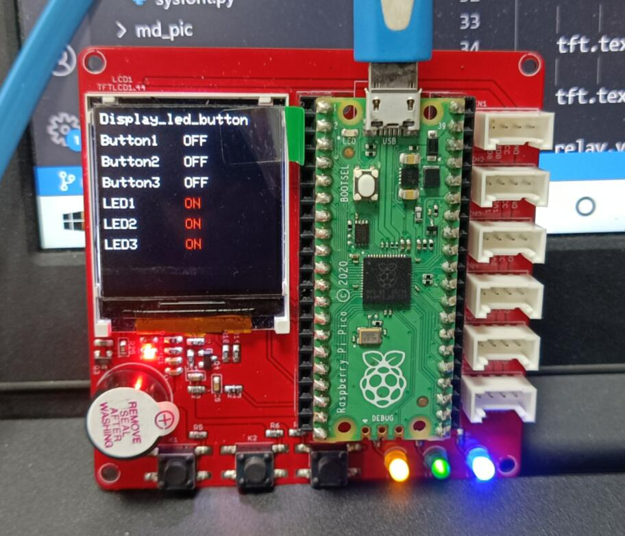
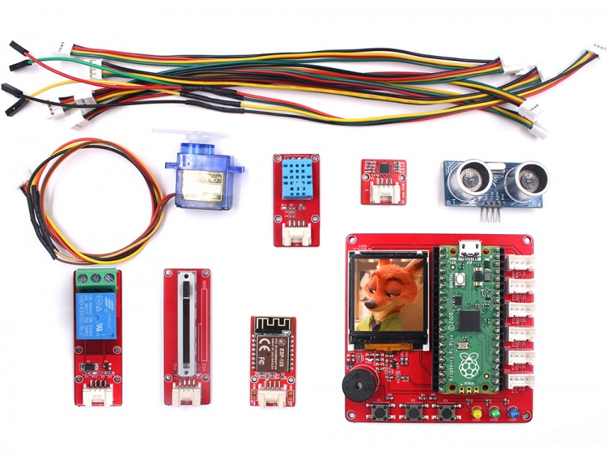
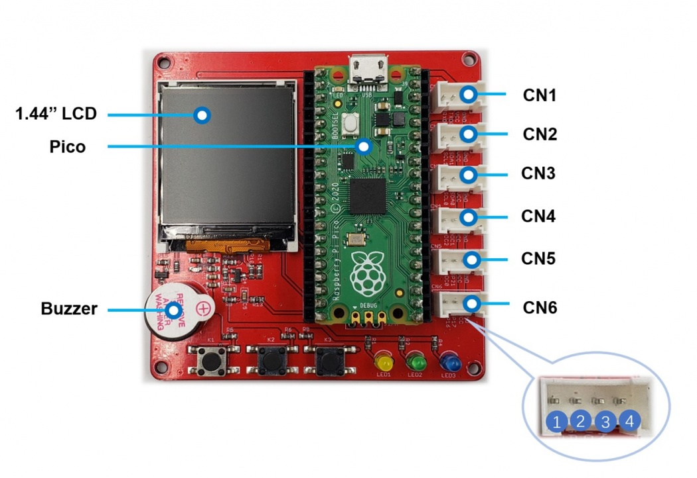

# Pico Primer Kit

```c++
/*
Version:		V1.3
Author:			Vincent
Create Date:	2021/4/16
Note:
	2021/7/27: V1.3 Add WS2812
	2021/5/24: V1.2 Change IR to Ultar distance sensor.
	2021/5/19: V1.1 Add 7 display example with MaBee module.
	
*/
```





[toc]

# Makerfabs

[Makerfabs home page](https://www.makerfabs.com/)

[Makerfabs Wiki](https://makerfabs.com/wiki/index.php?title=Main_Page)


# Pico Primer Kit
## Intruduce

### Product Link ：[Raspberry Pi Pico Primer Kit](https://www.makerfabs.com/raspberry-pi-pico-primer-kit.html)

### Wiki Link : [Pico_Primer_kit](https://www.makerfabs.com/wiki/index.php?title=Pico_Primer_Kit)

Pico Primer Kit is the development shield of Pi Pico. It has ST7735 color screen, 3 LED lights and 3 buttons. There are multiple SPI, I2C, UART, GPIO interfaces.
Kit contains a number of MBEE series modules. Such as potentiometer, DHT11, MPU6050, relay and other modules.


## Feature

- RP2040 microcontroller chip designed by Raspberry Pi in the United Kingdom
- Dual-core Arm Cortex M0+ processor, the flexible clock running up to 133 MHz
- 264KB of SRAM, and 2MB of onboard Flash memory
- Castellated module allows soldering direct to carrier boards
- USB 1.1 with device and host support
- Low-power sleep and dormant modes
- Drag-and-drop programming using mass storage over USB
- 26 × multi-function GPIO pins
- 2 × SPI, 2 × I2C, 2 × UART, 3 × 12-bit ADC, 16 × controllable PWM channels
- Accurate clock and timer on-chip
- Temperature sensor
- Accelerated floating-point libraries on-chip
- 8 × Programmable I/O (PIO) state machines for custom peripheral support


### Front:



### Back:



# Example
## Equipment list

- Pico Primer Kit
- Pi Pico
- MBee modules


## How To Use?
**If you have any questions，such as how to install the development board, how to download the code.**

**Please refer to :[Get Started with MicroPython on Raspberry Pi Pico](https://hackspace.raspberrypi.org/books/micropython-pico)**


## V1.1 Project

### project-1-display_led_button.py

Control onboard leds via buttons.
And display status on TFT screen.
Don't need any module

### project-2-leveling.py

Simple graphic level, read inclination angle with MPU6050.
Insert MaBee MPU6050 to CN3

### project-3-adc_display.py

The voltage value of the read slide potentimeter is displayed on the screen
Insert MaBee Slide Potentimeter to CN5

### project-4-weather_8266.py

Connect to WiFi through ESP8266 module and get the weather.
Insert MaBee 8266 to CN1
API from "api.openweathermap.org" is not stable, please try more and pay attention to the serial port information.

### project-5-temperature .py

The temperature and humidity are obtained through DHT11 and displayed on the screen
Insert MaBee DHT11 to CN6

### ~~project-6-ir_distance.py~~

~~The distance is captured by a Sharpir sensor and displayed on the screen~~
~~Insert SharpIR to CN5~~

### project-6-HC-SR04_distance.py

The distance is captured by a HC-SR04 Ultra sensor and displayed on the screen
Insert SharpIR to CN6

### project-7-servo_control.py

Use button control servo and MaBee relay
Insert Servo to CN6
Insert MaBee Relay to CN5

### project-8-ws2812.py
Insert WS2812 to CN6


## Example List

### test_display.py

Test ST7735 LCD screen.

- Copy ST7735.py and sysfont.py to /lib
- Copy test_display.py to /code
- Run test_display.py

### test_dht11.py

Using DHT11 sensor  to get temperature and humidity.
- Copy dht.py to /lib
- Copy test_dht11.py to /code
- Run test_dht11.py

### test_imu.py

Testing MPU6050.

- Copy mpu6050.py to /lib
- Copy test_imu.py to /code
- Run test_imu.py

### test_sharpIR.py

Using Sharp GP2Y0A21 IR sensor  to get distance.

- Copy test_sharpIR.py to /code
- Run test_sharpIR.py


## Code Explain
- Import Library

```python
from ST7735 import TFT
from sysfont import sysfont
from machine import SPI, Pin
import time
import math
```
