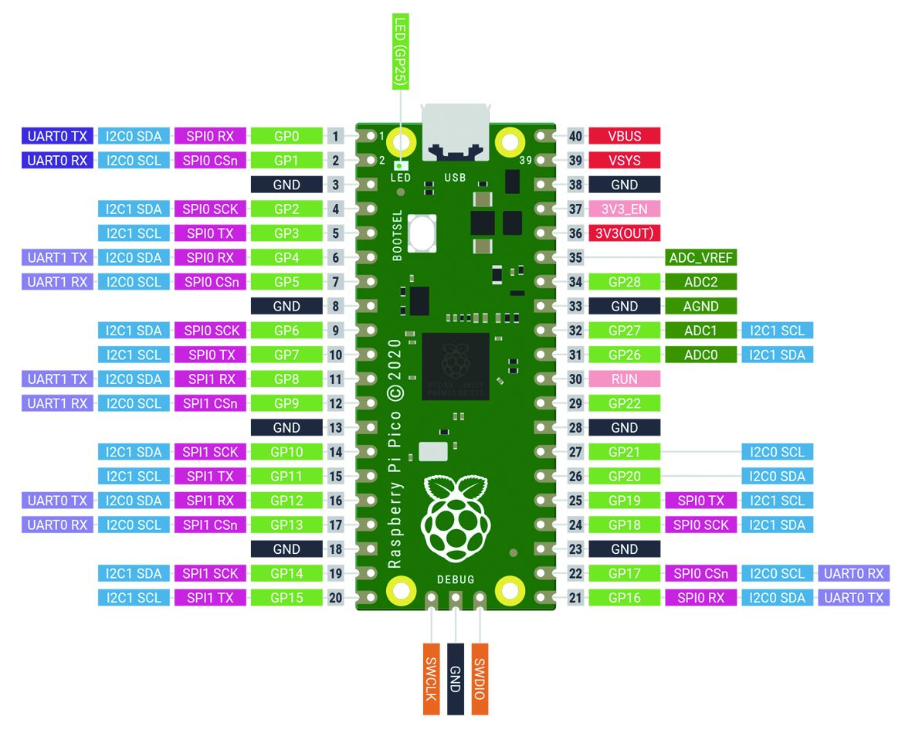

# Pico Primer Kit

```c++
/*
Version:		V1.0
Author:			Vincent
Create Date:	2021/4/16
Note:
	
*/
```


[toc]

# Makerfabs

[Makerfabs home page](https://www.makerfabs.com/)

[Makerfabs Wiki](https://makerfabs.com/wiki/index.php?title=Main_Page)


# Pico Primer Kit
## Intruduce

Product Link ：[]()

Wiki Link : []()

Pico Primer Kit is the development shield of Pi Pico. It has ST7735 color screen, 3 LED lights and 3 buttons. There are multiple SPI, I2C, UART, GPIO interfaces.
Kit contains a number of MBEE series modules. Such as potentiometer, DHT11, MPU6050, relay and other modules.


## Feature

- RP2040 microcontroller chip designed by Raspberry Pi in the United Kingdom
- Dual-core Arm Cortex M0+ processor, the flexible clock running up to 133 MHz
- 264KB of SRAM, and 2MB of onboard Flash memory
- Castellated module allows soldering direct to carrier boards
- USB 1.1 with device and host support
- Low-power sleep and dormant modes
- Drag-and-drop programming using mass storage over USB
- 26 × multi-function GPIO pins
- 2 × SPI, 2 × I2C, 2 × UART, 3 × 12-bit ADC, 16 × controllable PWM channels
- Accurate clock and timer on-chip
- Temperature sensor
- Accelerated floating-point libraries on-chip
- 8 × Programmable I/O (PIO) state machines for custom peripheral support


### Front:


### Back:


# Example
## Equipment list

- Pico Primer Kit
- Pi Pico
- MBee modules


## How To Use?
**If you have any questions，such as how to install the development board, how to download the code.**

**Please refer to :[Get Started with MicroPython on Raspberry Pi Pico](https://hackspace.raspberrypi.org/books/micropython-pico)**





## Example List

### test_display.py

Test ST7735 LCD screen.

- Copy ST7735.py and sysfont.py to /lib
- Copy test_display.py to /code
- Run test_display.py

### test_dht11.py

Using DHT11 sensor  to get temperature and humidity.
- Copy dht.py to /lib
- Copy test_dht11.py to /code
- Run test_dht11.py

### test_imu.py

Testing MPU6050.

- Copy mpu6050.py to /lib
- Copy test_imu.py to /code
- Run test_imu.py

### test_sharpIR.py

Using Sharp GP2Y0A21 IR sensor  to get distance.

- Copy test_sharpIR.py to /code
- Run test_sharpIR.py


## Code Explain
- Import Library

```python
from ST7735 import TFT
from sysfont import sysfont
from machine import SPI, Pin
import time
import math
```
